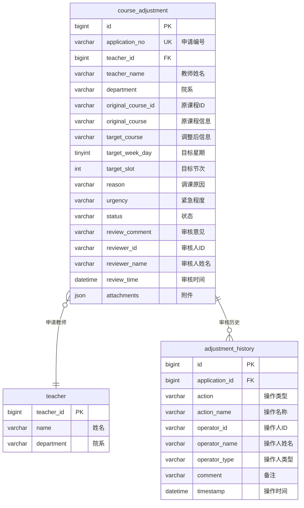
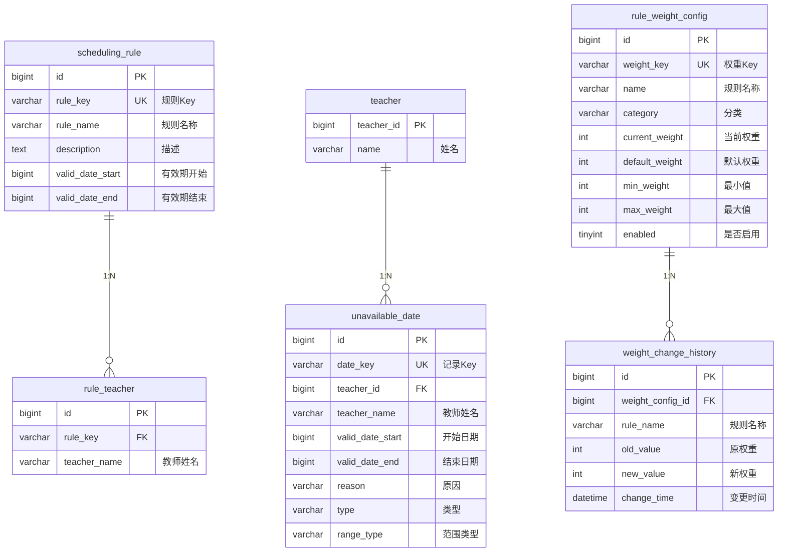

# 智能排课系统 - 完整 ER 图

## 全貌 ER 图（21 张表）

```mermaid
erDiagram

    %% ===== 基础数据模块 =====
    course {
        bigint course_id PK
        varchar id UK "业务ID如C001"
        varchar course_name "课程名称"
        decimal credits "学分"
        int duration "持续周数"
        int priority "排课优先级"
        varchar course_type "课程类型"
        int total_hours "总学时"
        datetime created_time
        datetime updated_time
    }

    course_setting {
        bigint id PK
        varchar course_name "课程名称"
        int priority "优先级"
        varchar semester "开课学期"
        datetime created_time
        datetime updated_time
    }

    course_prerequisite {
        bigint id PK
        bigint course_setting_id FK "课程设置ID"
        varchar prerequisite_name "先修课程名称"
    }

    major {
        bigint id PK
        varchar major_id UK "业务ID如M001"
        varchar major_name "专业名称"
        int class_size "班级人数"
        int duration "学制年"
        datetime created_time
        datetime updated_time
    }

    major_required_course {
        bigint id PK
        bigint major_id FK "专业ID"
        varchar course_name "必修课程名"
    }

    teacher {
        bigint teacher_id PK
        varchar name "姓名"
        varchar job_number UK "工号"
        varchar department "院系"
        int max_daily_courses "每日最大课程数"
        datetime created_time
        datetime updated_time
    }

    teacher_teachable_course {
        bigint id PK
        bigint teacher_id FK "教师ID"
        varchar course_name "可授课程名"
    }

    %% ===== 课表管理模块 =====
    semester {
        bigint semester_id PK
        varchar semester_name UK "学期名称"
        date start_date "开始日期"
        date end_date "结束日期"
        datetime created_time
        datetime updated_time
    }

    class {
        bigint class_id PK
        varchar class_name "班级名称"
        varchar major_id FK "专业ID"
        int student_count "学生人数"
        varchar grade "年级"
        datetime created_time
        datetime updated_time
    }

    room {
        bigint room_id PK
        varchar room_name "教室名称"
        int capacity "容量"
        varchar type "类型"
        varchar building "所在楼宇"
        tinyint floor "楼层"
        datetime created_time
        datetime updated_time
    }

    time_slot {
        varchar id PK "如Mon-1"
        int day_of_week "星期1-7"
        int period "节次1-12"
        varchar display_name "显示名"
        datetime created_time
        datetime updated_time
    }

    schedule {
        bigint schedule_id PK
        bigint course_id FK "课程ID"
        bigint teacher_id FK "教师ID"
        bigint class_id FK "班级ID"
        bigint room_id FK "教室ID"
        bigint semester_id FK "学期ID"
        date class_time "上课日期"
        int week "第几周"
        int period "第几节"
        varchar status "状态"
        datetime created_time
        datetime updated_time
    }

    teacher_available_slot_v2 {
        bigint id PK
        bigint teacher_id FK "教师ID"
        varchar time_slot_id FK "时间段ID"
        datetime created_time
    }

    teacher_preferred_slot_v2 {
        bigint id PK
        bigint teacher_id FK "教师ID"
        varchar time_slot_id FK "时间段ID"
        datetime created_time
    }

    %% ===== 调课申请审核模块 =====
    course_adjustment {
        bigint id PK
        varchar application_no UK "申请编号"
        bigint teacher_id FK "教师ID"
        varchar teacher_name "教师姓名"
        varchar department "院系"
        varchar original_course_id FK "原课程ID"
        varchar original_course "原课程信息"
        varchar target_course "调整后信息"
        tinyint target_week_day "目标星期"
        int target_slot "目标节次"
        varchar reason "调课原因"
        varchar urgency "紧急程度"
        varchar status "状态"
        varchar review_comment "审核意见"
        varchar reviewer_id "审核人ID"
        varchar reviewer_name "审核人姓名"
        datetime review_time "审核时间"
        json attachments "附件"
        datetime created_time
        datetime updated_time
    }

    adjustment_history {
        bigint id PK
        bigint application_id FK "申请ID"
        varchar action "操作类型"
        varchar action_name "操作名称"
        varchar operator_id "操作人ID"
        varchar operator_name "操作人姓名"
        varchar operator_type "操作人类型"
        varchar comment "备注"
        datetime timestamp "操作时间"
    }

    %% ===== 规则配置模块 =====
    scheduling_rule {
        bigint id PK
        varchar rule_key UK "规则Key"
        varchar rule_name "规则名称"
        text description "描述"
        bigint valid_date_start "有效期开始"
        bigint valid_date_end "有效期结束"
        datetime created_time
        datetime updated_time
    }

    rule_teacher {
        bigint id PK
        varchar rule_key FK "规则Key"
        varchar teacher_name "教师姓名"
    }

    unavailable_date {
        bigint id PK
        varchar date_key UK "记录Key"
        bigint teacher_id FK "教师ID"
        varchar teacher_name "教师姓名"
        bigint valid_date_start "开始日期"
        bigint valid_date_end "结束日期"
        varchar reason "原因"
        varchar type "类型"
        varchar range_type "范围类型"
        datetime created_time
    }

    rule_weight_config {
        bigint id PK
        varchar weight_key UK "权重Key"
        varchar name "规则名称"
        varchar category "分类"
        int current_weight "当前权重"
        int default_weight "默认权重"
        int min_weight "最小值"
        int max_weight "最大值"
        tinyint enabled "是否启用"
        text description "描述"
        datetime created_time
        datetime updated_time
    }

    weight_change_history {
        bigint id PK
        bigint weight_config_id FK "权重配置ID"
        varchar rule_name "规则名称"
        int old_value "原权重"
        int new_value "新权重"
        datetime change_time "变更时间"
        varchar operator_id "操作人ID"
        varchar operator_name "操作人姓名"
    }

    %% ===== 智能排课模块 =====
    schedule_operation_history {
        bigint id PK
        varchar action "操作类型"
        varchar course_id "课程业务ID"
        varchar course_name "课程名称"
        varchar teacher_name "教师姓名"
        varchar class_name "班级名称"
        tinyint day_of_week "星期"
        int period "节次"
        int week "周次"
        bigint schedule_id FK "排课记录ID"
        varchar operator "操作人"
        datetime timestamp "操作时间"
    }

    %% ===== 关系定义 =====

    %% 基础数据
    course_setting ||--o{ course_prerequisite : "先修课程"
    major ||--o{ major_required_course : "必修课程"
    teacher ||--o{ teacher_teachable_course : "可授课程"
    class }o--|| major : "所属专业"

    %% 课表管理
    schedule }o--|| course : "排课课程"
    schedule }o--|| teacher : "排课教师"
    schedule }o--|| class : "排课班级"
    schedule }o--|| room : "排课教室"
    schedule }o--|| semester : "所属学期"
    teacher ||--o{ teacher_available_slot_v2 : "可用时间"
    teacher ||--o{ teacher_preferred_slot_v2 : "偏好时间"
    time_slot ||--o{ teacher_available_slot_v2 : "时间段"
    time_slot ||--o{ teacher_preferred_slot_v2 : "时间段"

    %% 调课审核
    course_adjustment }o--|| teacher : "申请教师"
    course_adjustment ||--o{ adjustment_history : "审核历史"

    %% 规则配置
    scheduling_rule ||--o{ rule_teacher : "关联教师"
    teacher ||--o{ unavailable_date : "不可用日期"
    rule_weight_config ||--o{ weight_change_history : "变更历史"

    %% 智能排课
    schedule ||--o{ schedule_operation_history : "操作历史"

```

---

## 分模块 ER 图

### 模块一：基础数据管理 (base-data-api.md)

```mermaid
erDiagram

    course {
        bigint course_id PK
        varchar id UK "业务ID"
        varchar course_name "课程名称"
        decimal credits "学分"
        int priority "优先级"
        varchar course_type "课程类型"
        int total_hours "总学时"
    }

    course_setting {
        bigint id PK
        varchar course_name "课程名称"
        int priority "优先级"
        varchar semester "开课学期"
    }

    course_prerequisite {
        bigint id PK
        bigint course_setting_id FK
        varchar prerequisite_name "先修课程"
    }

    major {
        bigint id PK
        varchar major_id UK "业务ID"
        varchar major_name "专业名称"
        int class_size "班级人数"
        int duration "学制年"
    }

    major_required_course {
        bigint id PK
        bigint major_id FK
        varchar course_name "必修课程"
    }

    class {
        bigint class_id PK
        varchar class_name "班级名称"
        varchar major_id "专业ID"
        int student_count "学生人数"
        varchar grade "年级"
    }

    teacher {
        bigint teacher_id PK
        varchar name "姓名"
        varchar job_number UK "工号"
        varchar department "院系"
        int max_daily_courses "每日最大课程数"
    }

    teacher_teachable_course {
        bigint id PK
        bigint teacher_id FK
        varchar course_name "可授课程"
    }

    course_setting ||--o{ course_prerequisite : "1:N"
    major ||--o{ major_required_course : "1:N"
    class }o--|| major : "N:1"
    teacher ||--o{ teacher_teachable_course : "1:N"

```

### 模块二：课表管理 (schedule-api.md + drag-schedule-api.md)

```mermaid
erDiagram

    semester {
        bigint semester_id PK
        varchar semester_name UK "学期名称"
        date start_date "开始日期"
        date end_date "结束日期"
    }

    course {
        bigint course_id PK
        varchar course_name "课程名称"
    }

    teacher {
        bigint teacher_id PK
        varchar name "姓名"
    }

    class {
        bigint class_id PK
        varchar class_name "班级名称"
    }

    room {
        bigint room_id PK
        varchar room_name "教室名称"
        int capacity "容量"
        varchar type "类型"
        varchar building "楼宇"
    }

    time_slot {
        varchar id PK "如Mon-1"
        int day_of_week "星期"
        int period "节次"
        varchar display_name "显示名"
    }

    schedule {
        bigint schedule_id PK
        bigint course_id FK
        bigint teacher_id FK
        bigint class_id FK
        bigint room_id FK
        bigint semester_id FK
        date class_time "上课日期"
        int week "周次"
        int period "节次"
        varchar status "状态"
    }

    teacher_available_slot_v2 {
        bigint id PK
        bigint teacher_id FK
        varchar time_slot_id FK
    }

    teacher_preferred_slot_v2 {
        bigint id PK
        bigint teacher_id FK
        varchar time_slot_id FK
    }

    schedule }o--|| course : "课程"
    schedule }o--|| teacher : "教师"
    schedule }o--|| class : "班级"
    schedule }o--|| room : "教室"
    schedule }o--|| semester : "学期"
    teacher ||--o{ teacher_available_slot_v2 : "可用时间"
    teacher ||--o{ teacher_preferred_slot_v2 : "偏好时间"
    time_slot ||--o{ teacher_available_slot_v2 : "时间段"
    time_slot ||--o{ teacher_preferred_slot_v2 : "时间段"

```

### 模块三：调课申请审核 (course-adjustment-api.md)



### 模块四：规则配置 (rule-configuration-api.md)



---

## 表清单与来源对照

| # | 表名 | 类型 | 来源 API 文档 | 状态 |
|---|------|------|---------------|------|
| 1 | course | 主表 | base-data-api | 已有 |
| 2 | course_setting | 主表 | base-data-api | 新增 |
| 3 | course_prerequisite | 关联表 | base-data-api | 新增 |
| 4 | major | 主表 | base-data-api | 新增 |
| 5 | major_required_course | 关联表 | base-data-api | 新增 |
| 6 | teacher | 主表 | base-data-api | 已有 |
| 7 | teacher_teachable_course | 关联表 | base-data-api | 新增 |
| 8 | semester | 主表 | - | 已有 |
| 9 | class | 主表 | - | 已有 |
| 10 | room | 主表 | - | 已有 |
| 11 | time_slot | 主表 | - | 已有 |
| 12 | schedule | 主表 | - | 已有 |
| 13 | teacher_available_slot_v2 | 关联表 | - | 已有 |
| 14 | teacher_preferred_slot_v2 | 关联表 | - | 已有 |
| 15 | course_adjustment | 主表 | course-adjustment-api | 新增 |
| 16 | adjustment_history | 明细表 | course-adjustment-api | 新增 |
| 17 | scheduling_rule | 主表 | rule-configuration-api | 新增 |
| 18 | rule_teacher | 关联表 | rule-configuration-api | 新增 |
| 19 | unavailable_date | 主表 | rule-configuration-api | 新增 |
| 20 | rule_weight_config | 主表 | rule-configuration-api | 新增 |
| 21 | weight_change_history | 明细表 | rule-configuration-api | 新增 |
| 22 | schedule_operation_history | 明细表 | smart-scheduling-api | 新增 |

## 统计

- **总表数**: 22 张
- **已有表**: 9 张
- **新增表**: 13 张
- **主表**: 15 张
- **关联表 (M:N)**: 5 张
- **明细/历史表**: 2 张
