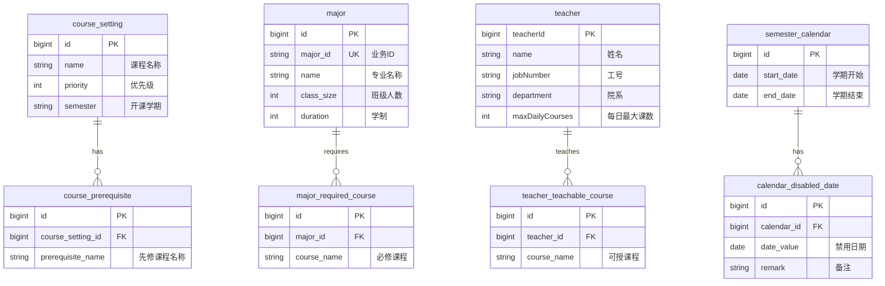
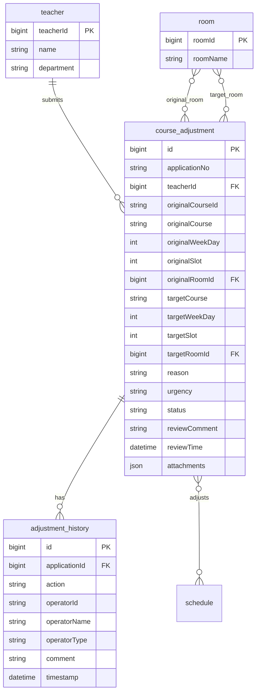
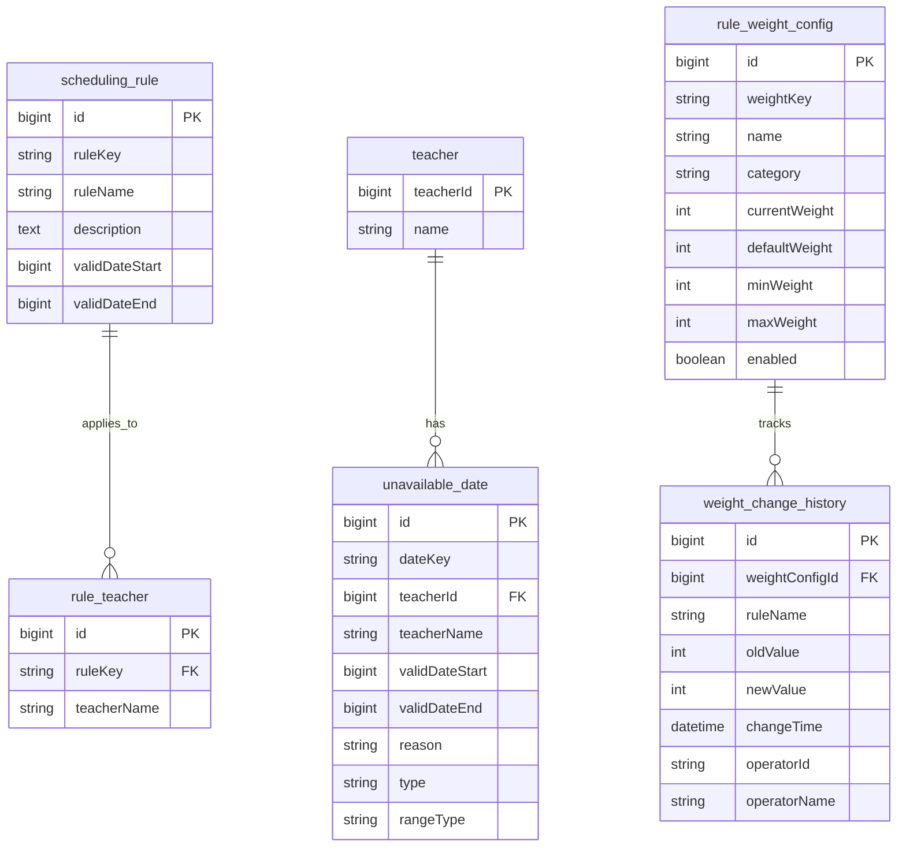
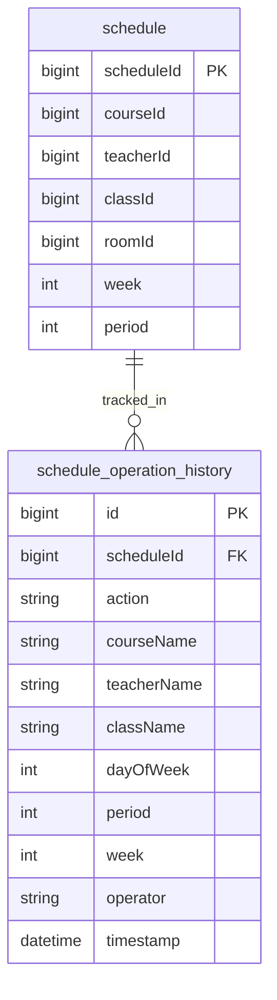

# 智能排课系统 - 数据库 ER 图

> 版本: v3.0 | 基于前端 7 个 API 文档设计

## 完整 ER 关系图（24 张表）

```mermaid
erDiagram
    %% ===== 基础数据模块 =====
    course_setting ||--o{ course_prerequisite : "1:N"
    major ||--o{ major_required_course : "1:N"
    major ||--o{ class : "1:N"
    teacher ||--o{ teacher_teachable_course : "1:N"
    teacher ||--o{ course_entity : "1:N"
    teacher ||--o{ teacher_available_slot_v2 : "1:N"
    teacher ||--o{ teacher_preferred_slot_v2 : "1:N"
    semester_calendar ||--o{ calendar_disabled_date : "1:N"

    course_setting {
        bigint id PK
        string name "课程名称"
        int priority "优先级"
        string semester "开课学期"
        datetime created_time
        datetime updated_time
    }
    course_prerequisite {
        bigint id PK
        bigint course_setting_id FK
        string prerequisite_name "先修课程名称"
    }
    course_entity {
        bigint courseId PK
        string id "业务ID"
        string courseName "课程名称"
        float credits "学分"
        int duration "持续时间"
        int priority "优先级"
        string courseType "课程类型"
        float totalHours "总学时"
    }
    major {
        bigint id PK
        string major_id UK "业务ID"
        string name "专业名称"
        int class_size "班级人数"
        int duration "学制"
        datetime created_time
        datetime updated_time
    }
    major_required_course {
        bigint id PK
        bigint major_id FK
        string course_name "必修课程名称"
    }
    teacher {
        bigint teacherId PK
        string name "姓名"
        string jobNumber "工号"
        string department "院系"
        int maxDailyCourses "每日最大课数"
    }
    teacher_teachable_course {
        bigint id PK
        bigint teacher_id FK
        string course_name "可授课程名称"
    }
    semester_calendar {
        bigint id PK
        date start_date "学期开始"
        date end_date "学期结束"
        datetime created_time
        datetime updated_time
    }
    calendar_disabled_date {
        bigint id PK
        bigint calendar_id FK
        date date_value "禁用日期"
        string remark "备注"
    }

    %% ===== 课表管理模块 =====
    semester ||--o{ class : "1:N"
    semester ||--o{ schedule : "1:N"
    class ||--o{ schedule : "1:N"
    room ||--o{ schedule : "1:N"
    course_entity ||--o{ schedule : "1:N"
    teacher ||--o{ schedule : "1:N"
    time_slot ||--o{ schedule : "1:N"

    semester {
        bigint semesterId PK
        string semesterName "学期名称"
        date startDate "开始日期"
        date endDate "结束日期"
    }
    class {
        bigint classId PK
        string classId "业务ID"
        string className "班级名称"
        string majorId "专业ID"
        int studentCount "学生人数"
        int grade "年级"
    }
    room {
        bigint roomId PK
        string roomName "教室名称"
        int capacity "容量"
        string type "类型"
        string building "楼宇"
        int floor "楼层"
    }
    time_slot {
        string id PK "如Mon-1"
        int dayOfWeek "星期1-7"
        int period "节次1-10"
        string displayName "显示名"
    }
    schedule {
        bigint scheduleId PK
        bigint courseId FK
        bigint teacherId FK
        bigint classId FK
        bigint roomId FK
        bigint semesterId FK
        string classTime "上课时间"
        int week "周次"
        int period "节次"
        string status "状态"
    }
    teacher_available_slot_v2 {
        bigint id PK
        bigint teacherId FK
        string timeSlotId FK
    }
    teacher_preferred_slot_v2 {
        bigint id PK
        bigint teacherId FK
        string timeSlotId FK
    }

    %% ===== 调课申请审核模块 =====
    teacher ||--o{ course_adjustment : "1:N"
    course_adjustment ||--o{ adjustment_history : "1:N"
    course_adjustment }o--o{ schedule : "关联"
    room }o--o{ course_adjustment : "原教室"
    room }o--o{ course_adjustment : "目标教室"

    course_adjustment {
        bigint id PK
        string applicationNo UK "申请编号"
        bigint teacherId FK
        string teacherName "教师姓名"
        string department "院系"
        string originalCourseId "原课程业务ID"
        string originalCourse "原课程信息"
        int originalWeekDay "原星期"
        int originalSlot "原节次"
        bigint originalRoomId "原教室ID"
        string targetCourse "调整后课程"
        int targetWeekDay "目标星期"
        int targetSlot "目标节次"
        bigint targetRoomId "目标教室ID"
        string reason "调课原因"
        string urgency "紧急程度"
        string status "状态"
        string reviewComment "审核意见"
        datetime reviewTime "审核时间"
        json attachments "附件"
    }
    adjustment_history {
        bigint id PK
        bigint applicationId FK
        string action "操作类型"
        string actionName "操作名称"
        string operatorId "操作人ID"
        string operatorName "操作人姓名"
        string operatorType "操作人类型"
        string comment "备注"
        datetime timestamp "操作时间"
    }

    %% ===== 规则配置模块 =====
    scheduling_rule ||--o{ rule_teacher : "1:N"
    teacher ||--o{ unavailable_date : "1:N"
    rule_weight_config ||--o{ weight_change_history : "1:N"

    scheduling_rule {
        bigint id PK
        string ruleKey UK "规则Key"
        string ruleName "规则名称"
        text description "描述"
        bigint validDateStart "有效期开始"
        bigint validDateEnd "有效期结束"
        datetime created_time
        datetime updated_time
    }
    rule_teacher {
        bigint id PK
        string ruleKey FK
        string teacherName "教师姓名"
    }
    unavailable_date {
        bigint id PK
        string dateKey UK "记录Key"
        bigint teacherId FK
        string teacherName "教师姓名"
        bigint validDateStart "开始日期"
        bigint validDateEnd "结束日期"
        string reason "原因"
        string type "类型"
        string rangeType "范围类型"
        datetime created_time
    }
    rule_weight_config {
        bigint id PK
        string weightKey UK "权重Key"
        string name "规则名称"
        string category "分类"
        int currentWeight "当前权重"
        int defaultWeight "默认权重"
        int minWeight "最小值"
        int maxWeight "最大值"
        boolean enabled "是否启用"
        string description "描述"
        datetime created_time
        datetime updated_time
    }
    weight_change_history {
        bigint id PK
        bigint weightConfigId FK
        string ruleName "规则名称"
        int oldValue "原权重"
        int newValue "新权重"
        datetime changeTime "变更时间"
        string operatorId "操作人ID"
        string operatorName "操作人姓名"
    }

    %% ===== 智能排课模块 =====
    schedule ||--o{ schedule_operation_history : "1:N"

    schedule_operation_history {
        bigint id PK
        string action "操作类型"
        string courseId "课程业务ID"
        string courseName "课程名称"
        string teacherName "教师姓名"
        string className "班级名称"
        int dayOfWeek "星期"
        int period "节次"
        int week "周次"
        bigint scheduleId FK
        string operator "操作人"
        datetime timestamp "操作时间"
    }
```

---

## 模块分图

### 一、基础数据模块



### 二、课表管理模块

```mermaid
erDiagram
    semester ||--o{ class : "has"
    semester ||--o{ schedule : "contains"
    class ||--o{ schedule : "has"
    room ||--o{ schedule : "hosts"
    course_entity ||--o{ schedule : "scheduled_as"
    teacher ||--o{ schedule : "teaches"
    time_slot ||--o{ schedule : "maps_to"
    teacher ||--o{ teacher_available_slot_v2 : "available"
    teacher ||--o{ teacher_preferred_slot_v2 : "preferred"

    semester {
        bigint semesterId PK
        string semesterName
        date startDate
        date endDate
    }
    class {
        bigint classId PK
        string className
        string majorId
        int studentCount
        int grade
    }
    room {
        bigint roomId PK
        string roomName
        int capacity
        string type
        string building
    }
    course_entity {
        bigint courseId PK
        string courseName
        float credits
        int duration
    }
    teacher {
        bigint teacherId PK
        string name
        string jobNumber
    }
    time_slot {
        string id PK
        int dayOfWeek
        int period
    }
    schedule {
        bigint scheduleId PK
        bigint courseId FK
        bigint teacherId FK
        bigint classId FK
        bigint roomId FK
        bigint semesterId FK
        string classTime
        int week
        int period
        string status
    }
    teacher_available_slot_v2 {
        bigint id PK
        bigint teacherId FK
        string timeSlotId FK
    }
    teacher_preferred_slot_v2 {
        bigint id PK
        bigint teacherId FK
        string timeSlotId FK
    }
```

### 三、调课申请审核模块



### 四、规则配置模块



### 五、智能排课模块



---

## 表清单

| # | 表名 | 模块 | 说明 |
|---|------|------|------|
| 1 | `course` | 基础数据 | 课程表（已有 JPA Entity） |
| 2 | `course_setting` | 基础数据 | 课程设置表 |
| 3 | `course_prerequisite` | 基础数据 | 课程先修关系表（M:N） |
| 4 | `major` | 基础数据 | 专业表 |
| 5 | `major_required_course` | 基础数据 | 专业必修课程关联表（M:N） |
| 6 | `teacher` | 基础数据 | 教师表（已有 JPA Entity） |
| 7 | `teacher_teachable_course` | 基础数据 | 教师可授课程关联表（M:N） |
| 8 | `semester_calendar` | 基础数据 | 学期日历表 |
| 9 | `calendar_disabled_date` | 基础数据 | 日历禁用日期表 |
| 10 | `semester` | 课表管理 | 学期表（已有 JPA Entity） |
| 11 | `class` | 课表管理 | 班级表（已有 JPA Entity） |
| 12 | `room` | 课表管理 | 教室表（已有 JPA Entity） |
| 13 | `time_slot` | 课表管理 | 时间段表（已有 JPA Entity） |
| 14 | `schedule` | 课表管理 | 排课记录表（已有 JPA Entity） |
| 15 | `teacher_available_slot_v2` | 课表管理 | 教师可用时间段（已有 JPA Entity） |
| 16 | `teacher_preferred_slot_v2` | 课表管理 | 教师偏好时间段（已有 JPA Entity） |
| 17 | `course_adjustment` | 调课审批 | 调课申请表 |
| 18 | `adjustment_history` | 调课审批 | 调课申请审核历史表 |
| 19 | `scheduling_rule` | 规则配置 | 排课规则表 |
| 20 | `rule_teacher` | 规则配置 | 规则-教师关联表（M:N） |
| 21 | `unavailable_date` | 规则配置 | 不可用日期表 |
| 22 | `rule_weight_config` | 规则配置 | 规则权重配置表 |
| 23 | `weight_change_history` | 规则配置 | 权重变更记录表 |
| 24 | `schedule_operation_history` | 智能排课 | 排课操作历史表 |

---

## 关系说明

### 一对多关系
- `course_setting` 1:N `course_prerequisite`
- `major` 1:N `major_required_course`
- `major` 1:N `class`
- `teacher` 1:N `teacher_teachable_course`
- `teacher` 1:N `course_entity`
- `teacher` 1:N `teacher_available_slot_v2`
- `teacher` 1:N `teacher_preferred_slot_v2`
- `semester_calendar` 1:N `calendar_disabled_date`
- `semester` 1:N `class`, `schedule`
- `class` 1:N `schedule`
- `room` 1:N `schedule`
- `course_entity` 1:N `schedule`
- `teacher` 1:N `schedule`
- `time_slot` 1:N `schedule`
- `teacher` 1:N `course_adjustment`
- `course_adjustment` 1:N `adjustment_history`
- `scheduling_rule` 1:N `rule_teacher`
- `teacher` 1:N `unavailable_date`
- `rule_weight_config` 1:N `weight_change_history`
- `schedule` 1:N `schedule_operation_history`

### 多对多关系（通过关联表）
- **课程设置 先修课程**: `course_setting` ↔ `course_prerequisite`
- **专业 必修课程**: `major` ↔ `major_required_course`
- **教师 可授课程**: `teacher` ↔ `teacher_teachable_course`
- **规则 教师**: `scheduling_rule` ↔ `rule_teacher`

### 跨模块关联
- `course_adjustment` → `schedule`（调课申请关联排课记录）
- `course_adjustment` → `room`（原教室 + 目标教室两条 N:1 关系）
